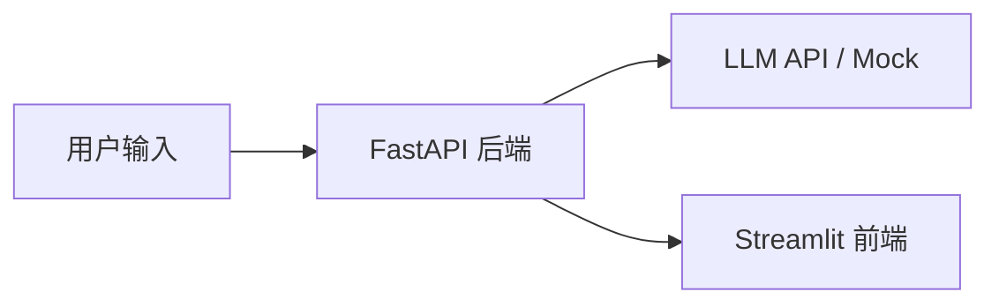

# 🍜 Cyber Foodie Agent

AI 大厨辩论系统：输入口味、预算与天气，两位 AI 大厨（「川辣派」vs「粤式养生派」）进行多轮自动辩论，最终输出结构化战报与菜品推荐。

[](https://github.com/F5488/Cyber-Foodie-Agent/actions)
[](https://opensource.org/licenses/MIT)
[](https://www.python.org/)
[]()

> 徽章中的仓库地址为 `F5488/Cyber-Foodie-Agent`，如需迁移请同步替换。

## 功能列表

- ✅ **US01 启动自动辩论** — 输入口味（辣/清淡）、预算（低/中/高）、天气（晴/雨/雪），系统触发两位大厨辩论
- ✅ **US02 实时查看辩论过程** — 聊天式展示两位大厨的轮流发言
- ✅ **US03 生成结构化战报** — 最终推荐、理由、双方观点、评分、获胜方
- ✅ **US04 自定义 Agent 性格** — 创建/克隆/编辑大厨，辩论可选任意两位
- ✅ **US05 结合真实菜单数据** — 导入菜单，推荐基于可购买菜品

## 架构

详见 [docs/system_design.md](docs/system_design.md)（含 6 张核心 Mermaid 图）。



## 快速启动

### 方式一：本地运行（推荐开发）

```bash
# 1. 安装依赖
pip install -r requirements.txt

# 2. 配置环境变量（Mock 模式可跳过）
cp .env.example .env

# 3. 启动后端（默认 Mock LLM，无需 API Key）
uvicorn src.main:app --reload --port 8000

# 4. 另开终端启动前端
streamlit run src/frontend.py
```

打开 http://localhost:8501 使用。

### 方式二：Docker 一键启动

```bash
docker compose up --build
```

- 后端：http://localhost:8000
- 前端：http://localhost:8501

## 环境变量说明

| 变量 | 说明 | 默认值 |
| --- | --- | --- |
| `LLM_PROVIDER` | `mock` / `openai_compatible` / `azure_openai` | `mock` |
| `OPENAI_BASE_URL` | OpenAI 兼容协议地址 | `https://api.deepseek.com` |
| `OPENAI_API_KEY` | OpenAI 兼容协议密钥 | 空 |
| `OPENAI_MODEL` | 模型名 | `deepseek-chat` |
| `AZURE_OPENAI_ENDPOINT` | Azure 端点 | 空 |
| `AZURE_OPENAI_KEY` | Azure 密钥 | 空 |
| `AZURE_OPENAI_DEPLOYMENT` | Azure 部署名 | 空 |
| `DEBATE_ROUNDS` | 辩论轮次 | `3` |
| `DATABASE_URL` | 数据库连接串 | `sqlite:///./foodie.db` |
| `RATE_LIMIT` | 单 IP 每分钟请求上限 | `60` |

> 🔐 **严禁将真实 API Key 提交到仓库**，密钥通过 `.env`（已加入 `.gitignore`）注入。

## API 文档

启动后端后访问 http://localhost:8000/docs 查看 Swagger 文档。

| 方法 | 路径 | 说明 |
| --- | --- | --- |
| `POST` | `/api/debate/start` | 启动辩论（US01，限每 IP 5 次/分钟，可选 agent_a_id/agent_b_id） |
| `GET` | `/api/debate/{session_id}/status` | 查询会话与发言（US02） |
| `GET` | `/api/debate/{session_id}/rounds` | 按轮次返回发言（US02） |
| `GET` | `/api/debate/{session_id}/report` | 返回结构化战报（US03） |
| `GET` | `/api/debate/sessions` | 返回全部历史会话 |
| `GET` | `/api/agents` | 列出全部 Agent（US04） |
| `POST` | `/api/agents` | 创建自定义 Agent（US04） |
| `PUT` | `/api/agents/{id}` | 更新 Agent（US04） |
| `DELETE` | `/api/agents/{id}` | 删除 Agent，预设不可删（US04） |
| `POST` | `/api/agents/{id}/clone` | 克隆 Agent（US04） |
| `POST` | `/api/menus/import` | 批量导入菜单（US05） |
| `GET` | `/api/menus` | 列出菜单，支持分类/价格过滤（US05） |
| `GET` | `/health` | 健康检查 |

### curl 调用示例

```bash
# 1. 启动辩论（默认两位大厨）
curl -X POST http://localhost:8000/api/debate/start \
  -H "Content-Type: application/json" \
  -d '{"taste":"辣","budget":"中","weather":"晴"}'

# 2. 指定自定义 Agent 辩论
curl -X POST http://localhost:8000/api/debate/start \
  -H "Content-Type: application/json" \
  -d '{"taste":"辣","budget":"中","weather":"晴","agent_a_id":"<自定义id>","agent_b_id":"agent-cantonese"}'

# 3. 查询战报
curl http://localhost:8000/api/debate/a1b2c3.../report

# 4. 创建自定义 Agent
curl -X POST http://localhost:8000/api/agents \
  -H "Content-Type: application/json" \
  -d '{"name":"日式轻食","system_prompt":"你是日式料理大厨","avatar":"🍣"}'

# 5. 导入菜单
curl -X POST http://localhost:8000/api/menus/import \
  -H "Content-Type: application/json" \
  --data-binary @eval/sample_menu.json
```

战报响应示例：

```json
{
  "final_choice": "麻辣香锅",
  "reason": "天气偏热且用户喜辣，川辣派方案更契合口味。",
  "pros_cons": {"pros": ["口味刺激"], "cons": ["偏油腻"]},
  "score": 8.5,
  "winner_agent": "川辣派",
  "menu_item_id": 1,
  "price": 28.0,
  "created_at": "2026-09-10T09:37:57"
}
```

## 数据库

- **开发**：SQLite（文件 `cyber_foodie.db`，已加入 `.gitignore`）
- **生产**：PostgreSQL（通过 `DATABASE_URL` 切换）
- 表结构对应 `docs/system_design.md` 的 ER 图：`sessions`、`agents`、`debate_rounds`、`recommendations`、`menus`
- 使用 **Alembic** 管理迁移：`alembic upgrade head` 建表/升级

## 测试

```bash
# 全部测试（单元 + 集成 + BDD）
pytest tests/unit tests/integration tests/bdd --cov=src --cov-report=term-missing
```

## 项目结构

```
.
├── .github/
│   ├── workflows/ci.yml        # GitHub Actions CI
│   ├── ISSUE_TEMPLATE/         # Issue 模板（User Story / Bug）
│   └── PULL_REQUEST_TEMPLATE.md
├── docs/
│   ├── system_design.md        # 系统设计（6 张 Mermaid 图）
│   ├── user_stories/           # US01~US05
│   ├── sprint1~4_report.md     # 4 份 Sprint 报告
│   └── presentation.md         # 答辩材料
├── src/
│   ├── main.py                 # FastAPI 入口
│   ├── models.py               # Pydantic 契约
│   ├── db.py                   # SQLAlchemy engine / session
│   ├── orm_models.py           # ORM 映射
│   ├── debate.py               # 辩论控制器
│   ├── report.py               # 战报生成器
│   ├── agent_service.py        # Agent 管理（US04）
│   ├── menu_service.py         # 菜单服务（US05）
│   ├── llm.py                  # LLM 客户端（多 provider + Mock）
│   ├── agents.py               # 预设大厨
│   └── frontend.py             # Streamlit 前端
├── tests/
│   ├── unit/                   # 单元测试
│   ├── integration/            # 集成测试
│   └── bdd/                    # BDD 验收测试
├── eval/
│   ├── evalset.json            # 评测数据集（11 场景）
│   ├── sample_menu.json        # 示例菜单（21 道菜）
│   └── run_eval.py             # 评分脚本
├── alembic/                    # 数据库迁移
├── Dockerfile / Dockerfile.frontend
├── docker-compose.yml
└── README.md
```

## 贡献者

| 成员 | 职责 | GitHub |
| --- | --- | --- |
| 符鹏 | 项目负责人 / 后端 | [F5488](https://github.com/F5488) |

<!-- 组员按需补充 -->

## 演示视频

<!-- 录制 3-5 分钟演示视频（OBS/Windows 录屏），上传 YouTube 或 docs/demo.mp4 后替换链接 -->
- 🎬 演示视频：[待补充](https://github.com/F5488/Cyber-Foodie-Agent)
- 演示分镜脚本见 [docs/demo_script.md](docs/demo_script.md)

## 评测

```bash
# 用内存模式跑评测（无需启动服务）
python eval/run_eval.py --no-serve

# 或用真实 HTTP（需先启动后端）
python eval/run_eval.py
```

输出 `eval/report.json` 与 `eval/report.md`。
