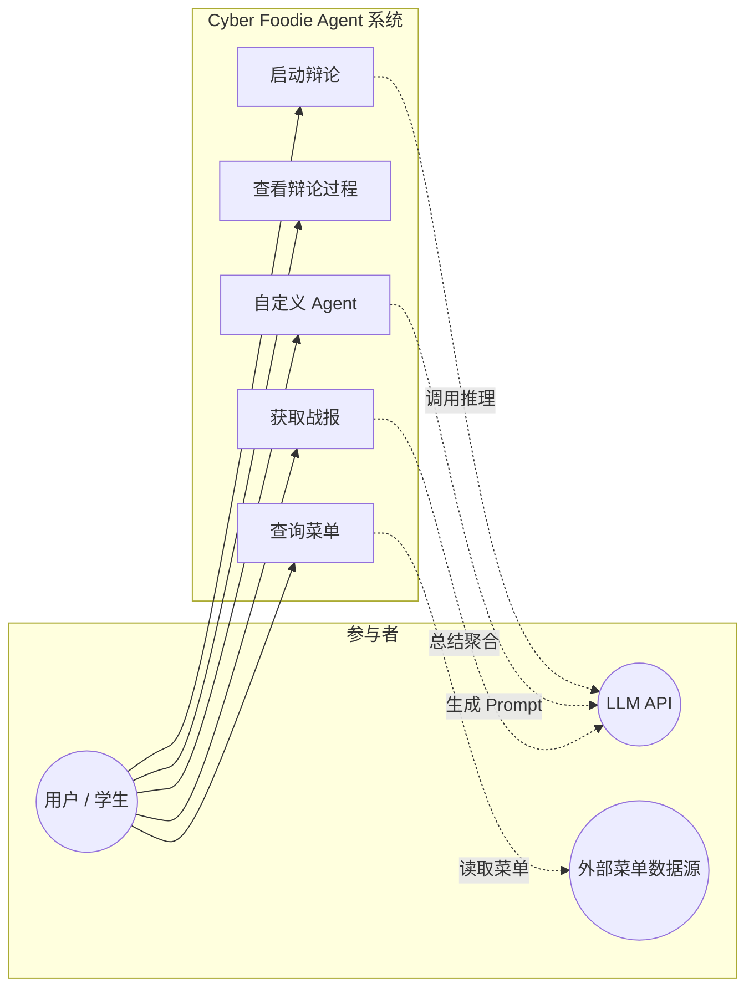
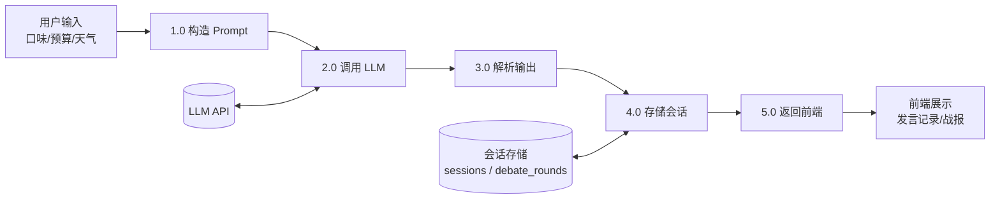
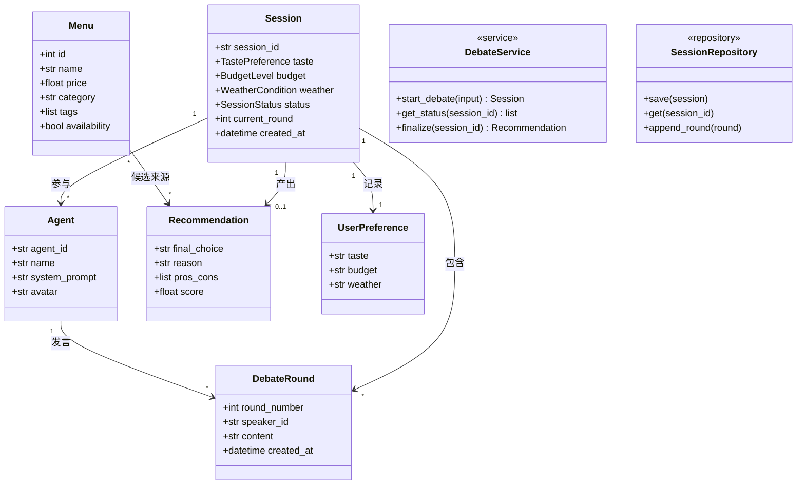
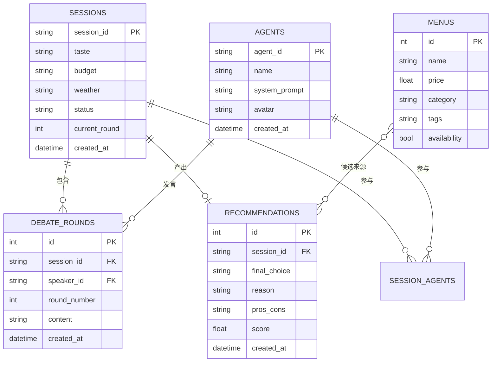
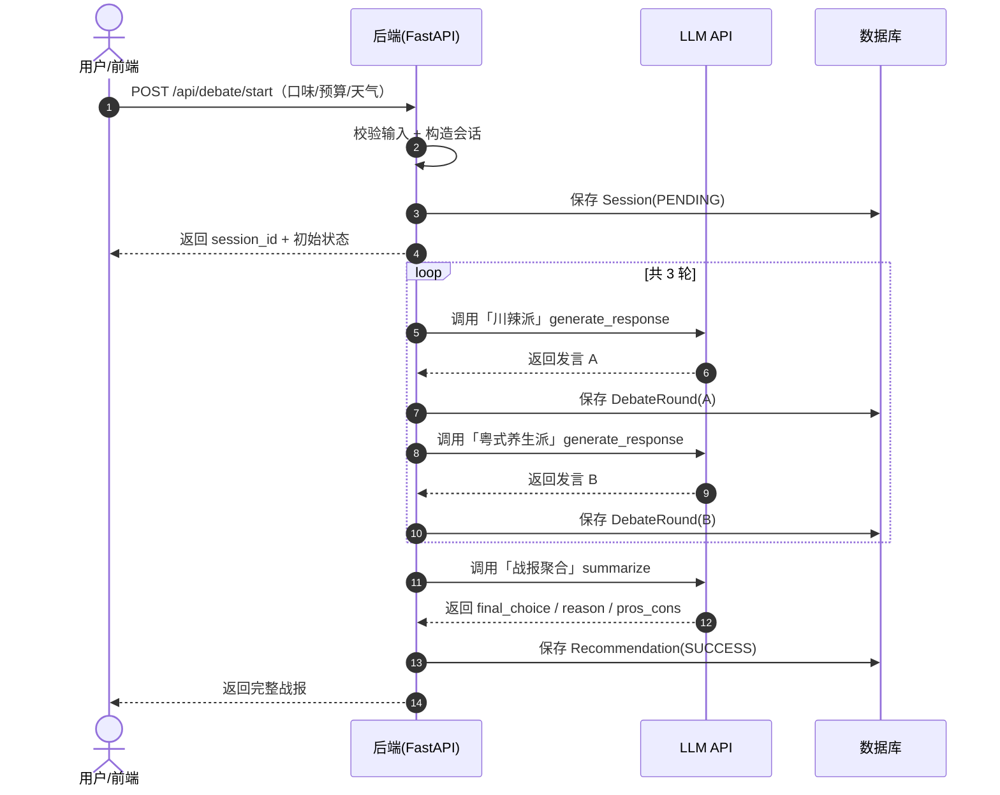
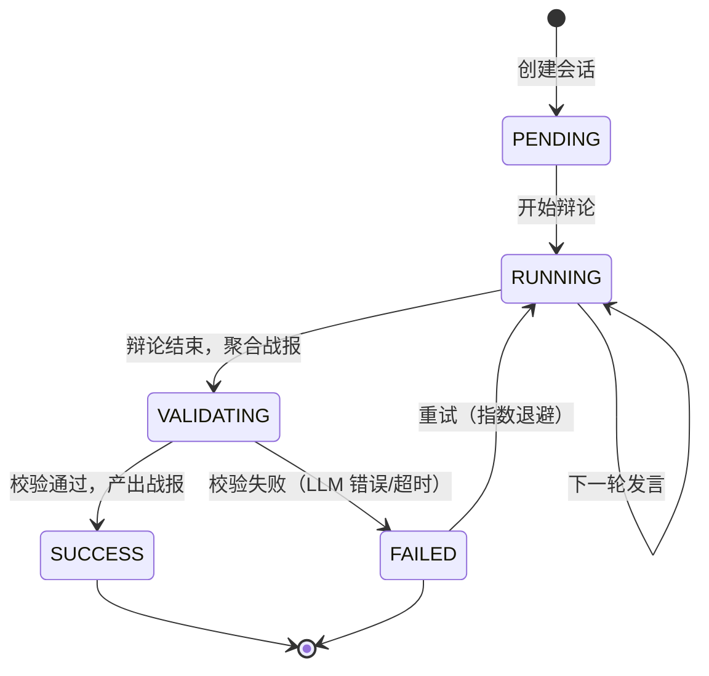

# 系统设计文档 — Cyber Foodie Agent

> 版本：v1.0（对应 Sprint 1-2 MVP，扩展部分标注「拓展」）
> 本文遵循《过程管理、软件工程规范与交付物要求》的「6 图体系」规范。

## 1. 项目概述

Cyber Foodie Agent 是一个「AI 大厨辩论」应用：用户输入口味偏好、预算与天气，系统驱动两位预设 AI 大厨（「川辣派」与「粤式养生派」）进行多轮自动辩论，最终聚合双方观点，输出一份包含最终推荐菜品的结构化战报。

- **MVP（Sprint 1-2）**：两位预设 Agent 的 3 轮自动辩论 + 结构化战报。
- **拓展（Sprint 3-4）**：用户自定义 Agent 性格、接入食堂/外卖真实菜单数据、CI/CD 与评测。

### 技术选型

| 层 | 选型 |
| --- | --- |
| 后端 | Python + FastAPI |
| 前端 | Streamlit（MVP） |
| 数据库 | SQLite（开发）→ PostgreSQL（生产） |
| LLM | 硅基流动 / Azure OpenAI / DeepSeek（通过环境变量切换，含 Mock 兜底） |
| 容器 | Docker + Docker Compose |

---

## 2. 六大核心架构图

### 2.1 用例图（Use Case Diagram）



**说明**：

- **用户/学生**：唯一的人类参与者，驱动所有用例。
- **LLM API**：被「启动辩论」「获取战报」「自定义 Agent」用例依赖，负责生成发言与聚合结论。
- **外部菜单数据源**（拓展）：为「查询菜单」提供真实可购买菜品。
- 5 个用例对应 5 个 User Story（US01~US05）。

---

### 2.2 数据流图（DFD）



**说明**：

- 数据自左向右流动：用户输入 → 后端构造 Prompt → 调用 LLM → 解析输出 → 持久化 → 返回前端。
- `P4` 与数据库双向交互（写入发言、读取历史上下文）。
- `P2` 与 LLM API 双向交互（发送 Prompt、接收补全结果）。

---

### 2.3 领域类图（Domain Class Diagram）



**说明**：

- 核心领域类为 `Session`、`Agent`、`DebateRound`、`Recommendation`、`Menu`、`UserPreference`。
- `Session` 为聚合根，贯穿一次辩论的完整生命周期。
- `DebateService`（服务层）编排辩论流程，`SessionRepository`（持久层接口）隔离存储细节。

---

### 2.4 数据库 ER 图（ER Diagram）



**说明**：

- 主键：`SESSIONS.session_id`、`AGENTS.agent_id`、`DEBATE_ROUNDS.id`、`RECOMMENDATIONS.id`、`MENUS.id`。
- 外键：`DEBATE_ROUNDS.session_id → SESSIONS`、`DEBATE_ROUNDS.speaker_id → AGENTS`、`RECOMMENDATIONS.session_id → SESSIONS`。
- 建议索引：`SESSIONS(created_at)`、`DEBATE_ROUNDS(session_id, round_number)`、`RECOMMENDATIONS(session_id)`。
- `SESSION_AGENTS` 为会话-大厨多对多关联表（用于拓展：自定义 Agent 参与辩论）。

---

### 2.5 系统时序图（System Sequence Diagram）



**说明**：

- 每次辩论有**两次 LLM 调用**（分别代表两位大厨），在 `loop` 内交替 3 轮。
- 前端与后端为同步请求；「实时查看」通过前端轮询 `GET /api/debate/{session_id}/status` 实现（MVP），拓展期可用 SSE/WebSocket。
- 战报聚合为一次额外的 LLM 调用，产出结构化结论。

---

### 2.6 状态机图（State Diagram）



**说明**：

- 会话状态：`PENDING`（等待开始）→ `RUNNING`（辩论中）→ `VALIDATING`（结果校验）→ `SUCCESS`（完成）或 `FAILED`。
- `RUNNING` 自环表示多轮发言推进。
- `FAILED → RUNNING` 体现防御性编程中的重试机制（指数退避）。

---

## 3. Pydantic 数据契约

数据契约定义于 [src/models.py](../src/models.py)，与 ER 图一一对应。核心字段说明：

| 模型 | 关键字段 | 说明 |
| --- | --- | --- |
| `Session` | `session_id`, `taste`, `budget`, `weather`, `status`, `current_round` | 一次辩论会话 |
| `Agent` | `agent_id`, `name`, `system_prompt`, `avatar` | 辩论参与方 |
| `DebateRound` | `round_number`, `speaker_id`, `content` | 单条发言 |
| `Recommendation` | `final_choice`, `reason`, `pros_cons`, `score`, `winner_agent` | 战报结论 |
| `Menu` | `name`, `price`, `category`, `tags`, `availability` | 可购买菜品（拓展） |

枚举类型：`TastePreference`（辣/清淡）、`BudgetLevel`（低/中/高）、`WeatherCondition`（晴/雨/雪）、`SessionStatus`（上述 5 态）。

---

## 4. 目录结构

```
.github/
  workflows/ci.yml          # GitHub Actions CI
  ISSUE_TEMPLATE/           # Issue 模板
  PULL_REQUEST_TEMPLATE.md
docs/
  system_design.md          # 本文
  user_stories/             # US01~US05
  sprint1~4_report.md
src/
  models.py                 # Pydantic 契约
  llm.py                    # LLM 客户端（多 provider + Mock）
  agents.py                 # Agent 类与预设大厨
  debate.py                 # DebateService 辩论控制器
  main.py                   # FastAPI 入口
  frontend.py               # Streamlit 前端
tests/
  unit/ integration/ bdd/
eval/
  evalset.json              # 评测数据集
.env.example  Dockerfile  docker-compose.yml  AGENTS.md  README.md
```
