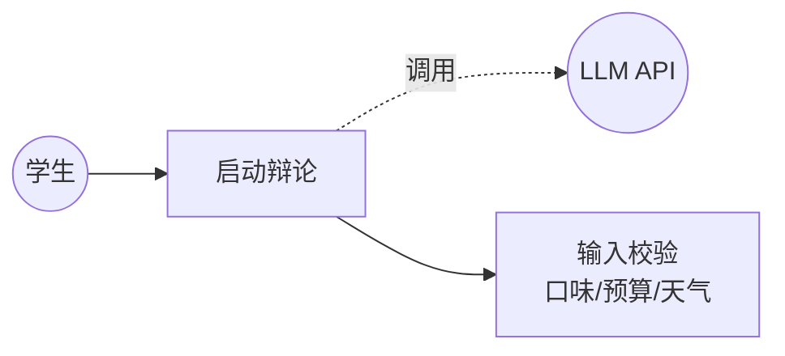
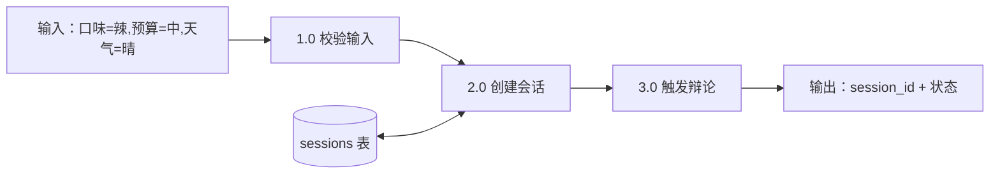
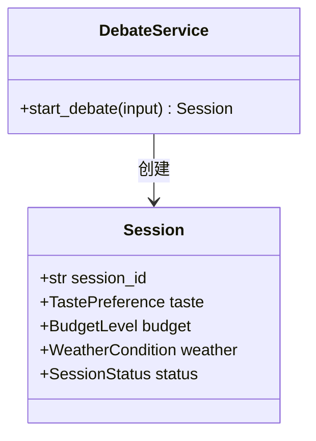
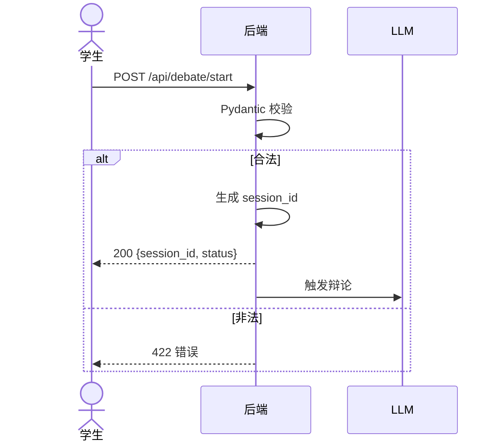
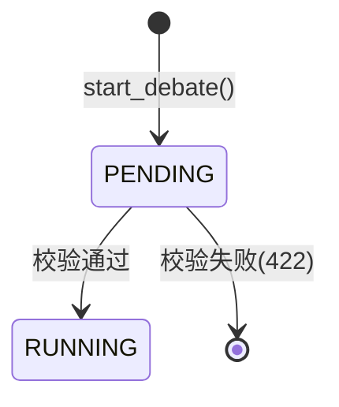
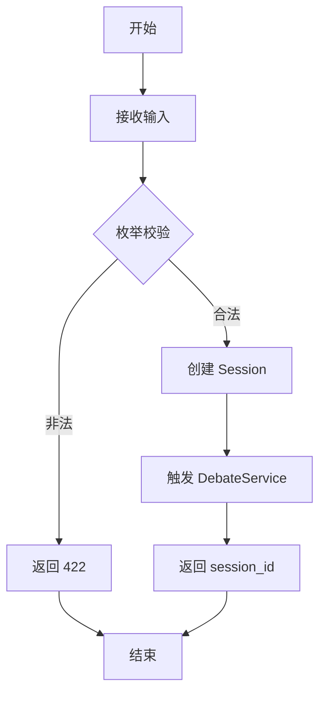

# US01 — 启动自动辩论

> 状态：MVP（Sprint 1）　故事点：5

## 用户故事

**As a** 学生
**I want to** 输入我的口味偏好（辣/清淡）、预算（低/中/高）和当前天气（晴/雨/雪）
**So that** 系统能自动触发两位大厨进行辩论并最终给我推荐

## 验收条件

- [x] 系统返回一个唯一 `session_id`
- [x] 立即启动辩论流程（异步或同步）
- [x] 输入校验：口味、预算、天气必须为合法枚举值
- [x] 非法输入返回 422 或明确错误信息

## Gherkin 场景

```gherkin
Feature: 启动自动辩论

  Scenario: 成功启动辩论
    Given 我提供口味偏好"辣"和预算"中"以及天气"晴"
    When 我提交启动请求
    Then 系统创建新会话并返回 session_id
    And 系统触发两位 Agent 开始辩论

  Scenario: 非法口味偏好被拒绝
    Given 我提供口味偏好"甜"（不在枚举中）
    When 我提交启动请求
    Then 系统返回 422 校验错误
    And 不创建任何会话

  Scenario: 会话状态初始为运行中
    Given 我成功提交启动请求
    When 我查询该 session_id 的状态
    Then 状态为 RUNNING 或 PENDING
```

## 故事级 Mermaid 图

### 1. 用例图



### 2. 数据流图（DFD）



### 3. 领域类图



### 4. 时序图



### 5. 状态机图



### 6. 活动图


