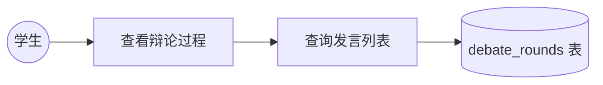
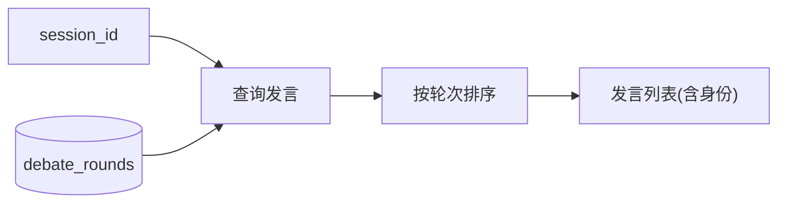
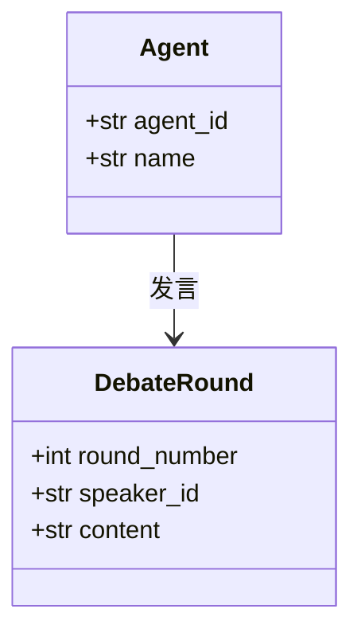
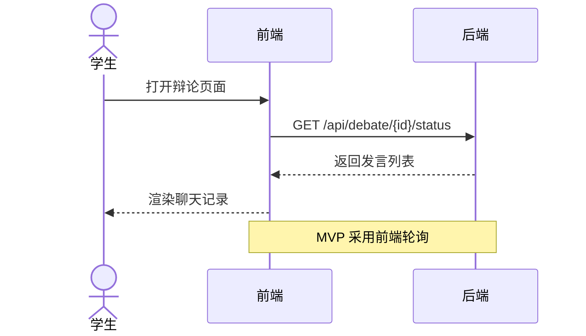
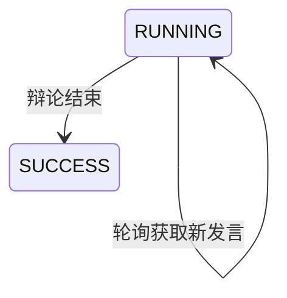
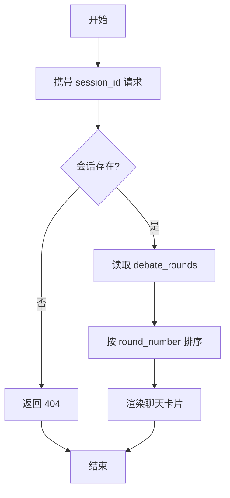

# US02 — 实时查看辩论过程

> 状态：MVP（Sprint 1）　故事点：5

## 用户故事

**As a** 学生
**I want to** 在辩论进行中或结束后查看两位大厨的轮流发言
**So that** 我能理解推荐背后的理由

## 验收条件

- [x] 前端展示类似聊天记录的流式或轮次式输出
- [x] 每位发言需标明 Agent 身份（川辣派 / 粤式养生派）
- [x] 支持按 session_id 查询全部发言
- [x] 发言按轮次有序排列

## Gherkin 场景

```gherkin
Feature: 实时查看辩论过程

  Scenario: 查询辩论发言
    Given 存在一个已启动的会话 session_id
    When 我调用 GET /api/debate/{session_id}/status
    Then 返回按轮次排序的发言列表
    And 每条发言包含 speaker_id 与 content

  Scenario: 发言标明 Agent 身份
    Given 辩论进行中
    When 我查看发言记录
    Then 每条发言标明"川辣派"或"粤式养生派"
    And 两位 Agent 交替发言

  Scenario: 查询不存在的会话
    Given 我提供不存在的 session_id
    When 我查询其状态
    Then 返回 404 错误
```

## 故事级 Mermaid 图

### 1. 用例图



### 2. 数据流图



### 3. 领域类图



### 4. 时序图



### 5. 状态机图



### 6. 活动图


