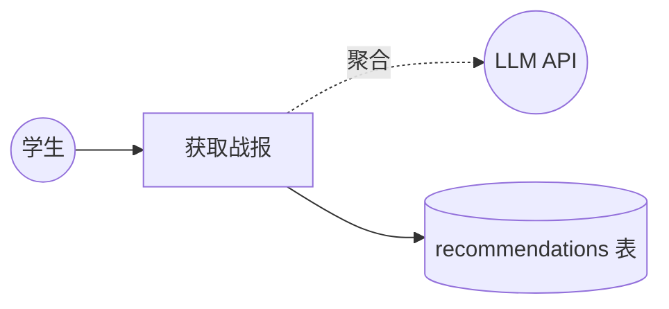
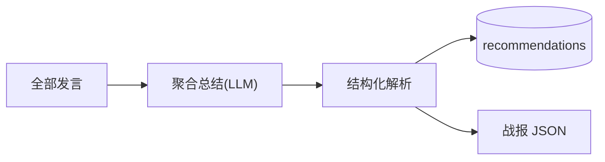
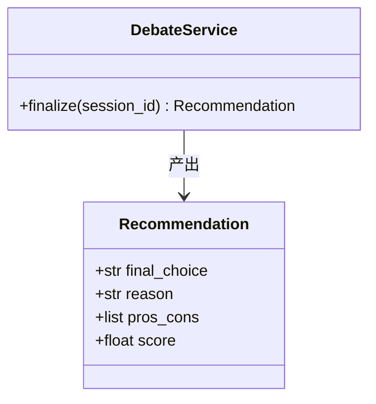
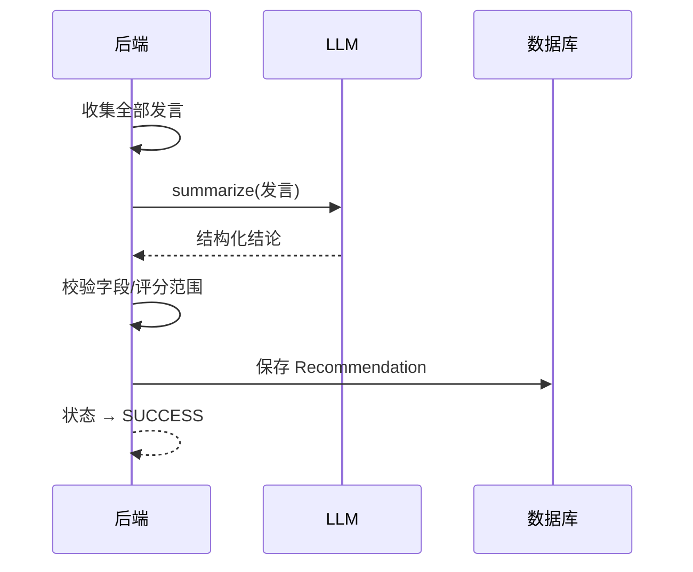
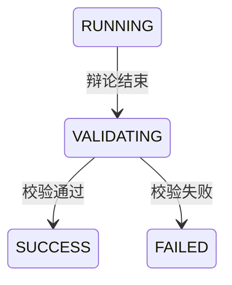
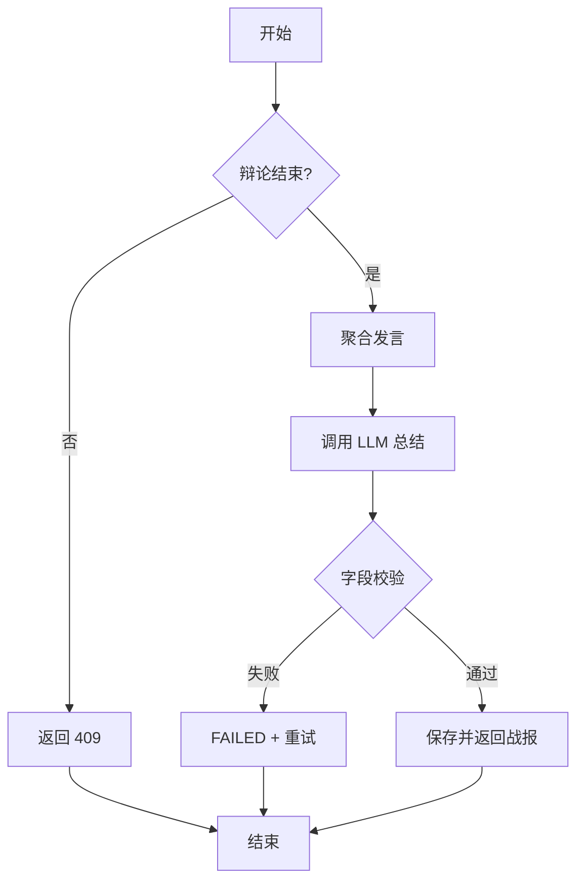

# US03 — 生成结构化战报与推荐

> 状态：MVP（Sprint 2）　故事点：8

## 用户故事

**As a** 学生
**I want to** 在辩论结束后获得一份包含最终推荐菜品、理由摘要、双方观点总结的战报
**So that** 我能快速决策

## 验收条件

- [x] 输出为 JSON 结构，包含 `final_choice`、`reason`、`pros_cons`、`score` 等字段
- [x] 前端以友好卡片形式展示
- [x] 战报在辩论结束后自动生成（或通过 finalize 接口触发）
- [x] 战报结果持久化存储

## Gherkin 场景

```gherkin
Feature: 生成结构化战报

  Scenario: 辩论结束生成战报
    Given 会话已完成 3 轮辩论
    When 系统触发战报生成
    Then 返回包含 final_choice / reason / pros_cons / score 的 JSON
    And 战报持久化到 recommendations 表

  Scenario: 战报字段完整
    Given 战报已生成
    When 我读取战报
    Then final_choice 非空
    And score 为 0 到 10 之间的数值
    And pros_cons 包含双方观点

  Scenario: 未完成辩论时请求战报
    Given 会话仍在辩论中
    When 我请求战报
    Then 返回 409 或提示"辩论尚未结束"
```

## 故事级 Mermaid 图

### 1. 用例图



### 2. 数据流图



### 3. 领域类图



### 4. 时序图



### 5. 状态机图



### 6. 活动图


