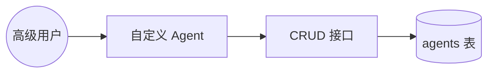
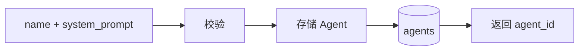
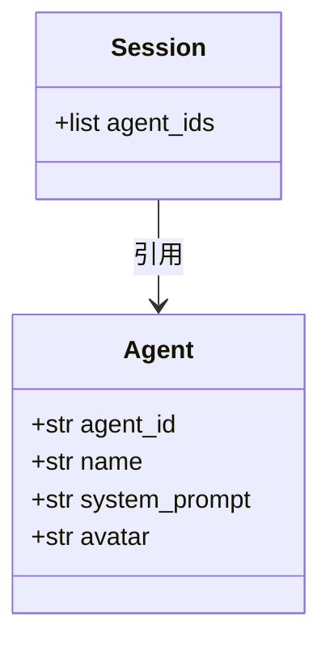
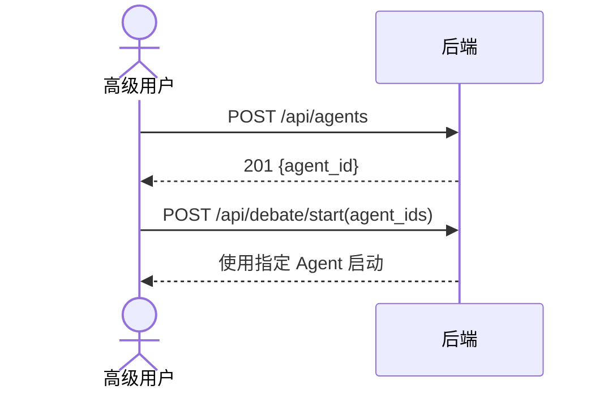
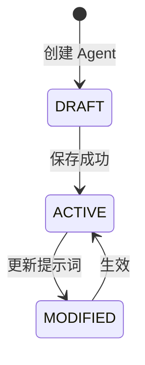
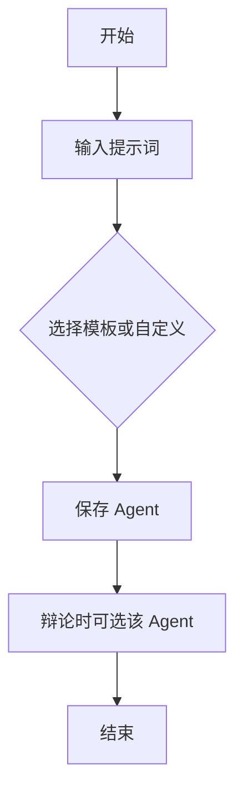

# US04 — 自定义 Agent 性格

> 状态：拓展（Sprint 3）　故事点：5

## 用户故事

**As a** 高级用户
**I want to** 创建或修改 Agent 的系统提示词（如「重辣」「清淡」「日式」等）
**So that** 辩论风格更贴合我的喜好

## 验收条件

- [x] 提供预设模板和自定义输入框
- [x] 修改后立即生效，影响后续辩论
- [x] 支持创建、修改、查询 Agent（CRUD）
- [x] 启动辩论时可选任意两个已存在的 Agent

## Gherkin 场景

```gherkin
Feature: 自定义 Agent 性格

  Scenario: 创建自定义 Agent
    Given 我提供 name 与 system_prompt
    When 我调用 POST /api/agents
    Then 系统创建 Agent 并返回 agent_id

  Scenario: 使用自定义 Agent 辩论
    Given 存在两个自定义 Agent
    When 我启动辩论并指定这两个 agent_id
    Then 辩论由这两个 Agent 参与

  Scenario: 修改 Agent 提示词
    Given 存在 Agent A
    When 我调用 PUT /api/agents/{id} 更新 system_prompt
    Then 后续辩论使用新的提示词
```

## 故事级 Mermaid 图

### 1. 用例图



### 2. 数据流图



### 3. 领域类图



### 4. 时序图



### 5. 状态机图



### 6. 活动图


