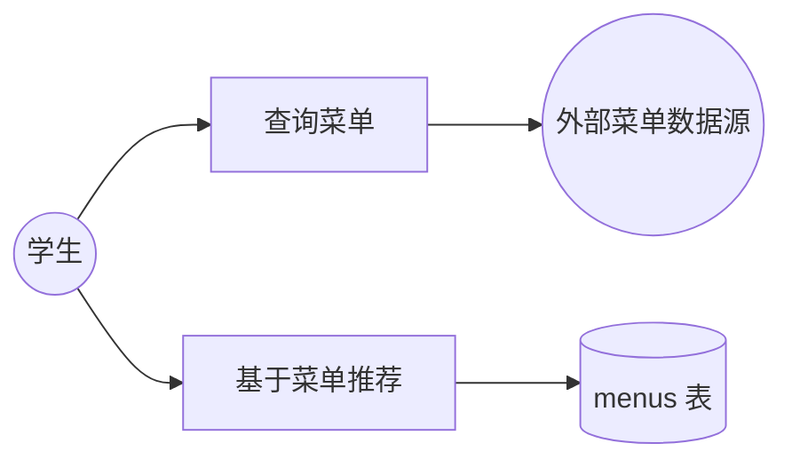
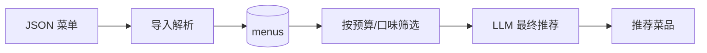
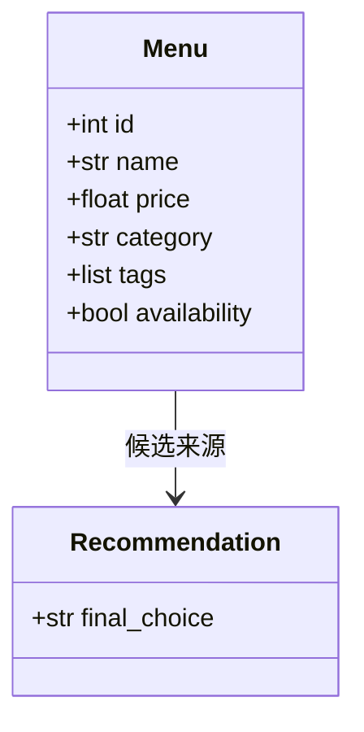
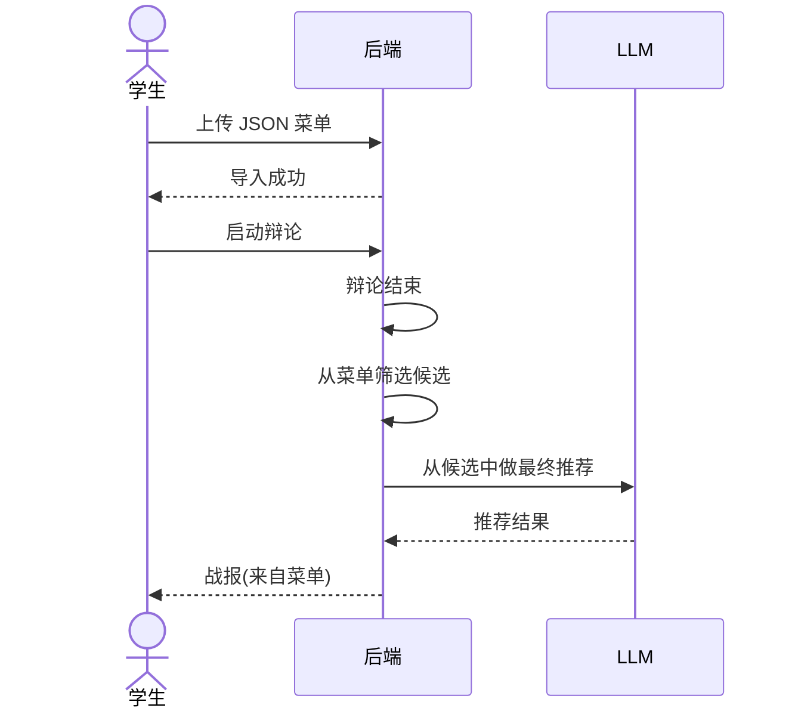
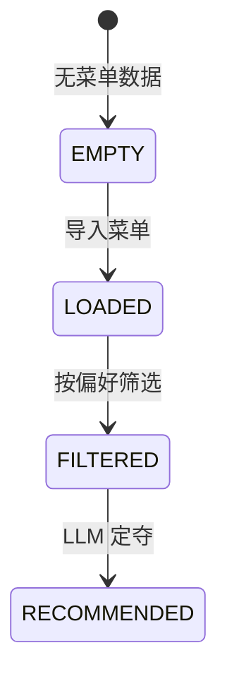
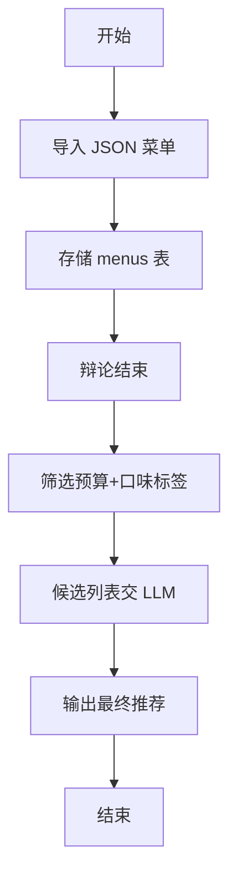

# US05 — 结合真实菜单数据

> 状态：拓展（Sprint 3）　故事点：8

## 用户故事

**As a** 学生
**I want to** 系统从食堂或外卖平台获取当前可用菜品（含价格、口味标签）
**So that** 推荐结果基于实际可购买的食物

## 验收条件

- [x] 支持 JSON 菜单数据导入或简易爬虫（可先用模拟数据验证）
- [x] 推荐菜品必须来自菜单列表
- [x] 菜品包含价格、口味标签等字段
- [x] 辩论结束后从菜单中筛选符合预算与口味的候选，再交由 LLM 定夺

## Gherkin 场景

```gherkin
Feature: 结合真实菜单数据

  Scenario: 导入菜单数据
    Given 我提供一份 JSON 菜单（含名称/价格/标签）
    When 我调用菜单导入接口
    Then 系统存储菜品并可查询

  Scenario: 推荐来自菜单
    Given 菜单列表存在且用户预算为"中"
    When 辩论结束生成推荐
    Then final_choice 必须存在于菜单列表中
    And 推荐菜品价格在预算区间内

  Scenario: 筛选候选
    Given 用户口味为"辣"
    When 系统筛选候选菜品
    Then 候选菜品包含"辣"口味标签
```

## 故事级 Mermaid 图

### 1. 用例图



### 2. 数据流图



### 3. 领域类图



### 4. 时序图



### 5. 状态机图



### 6. 活动图


